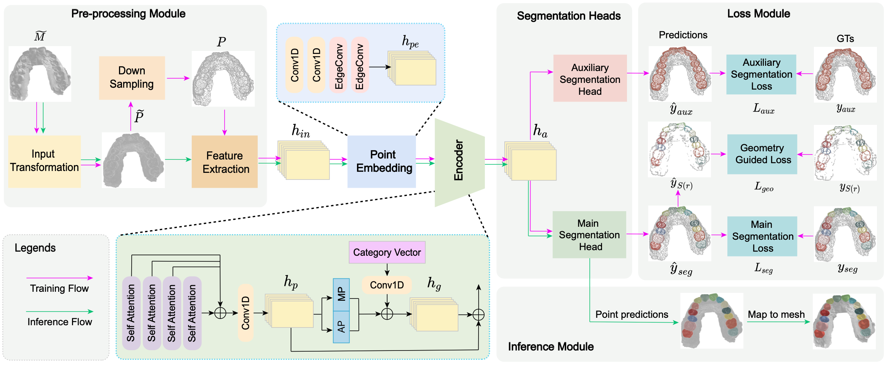

# TSegFormer: 3D Tooth Segmentation in Intraoral Scans with Geometry Guided Transformer
This is the PyTorch implementation of TSegFormer [MICCAI 2023]. 

TSegFormer is a novel 3D tooth segmentation framework with a tailed 3D transformer and a multi-task learning paradigm, 
aiming at distinguishing the permanent teeth with divergent anatomical structures and noisy boundaries. Moreover, we 
design a geometry-guided loss based on a novel point curvature to refine boundaries in an end-to-end manner, avoiding 
time-consuming post-processing to reach clinically applicable segmentation.

## Usage

### Requirements

* python==3.7.11
* torch==1.9.0+cu111
* scikit-learn
* tqdm

### Data samples
Two samples are shown in the `./data` folder: a mandible (lower jaw) sample and a maxillary (upper jaw) sample.

### Training nad testing 
Run the training script for pretraining:

`python main.py --epochs 200 --num_points 10000`

Run the evaluation script with the pretrained model `best_model.t7` for testing:

`python main.py --eval True --model_path best_model.t7`

## Citation

If you find our work useful in your research, please consider citing: